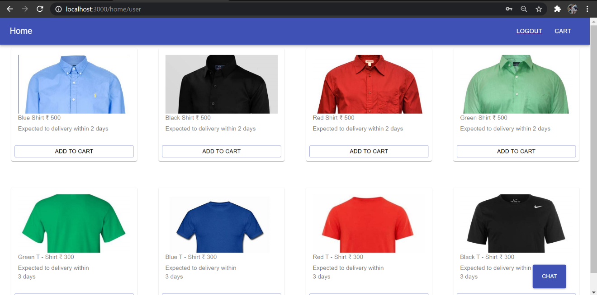

# Realtime-chat
Real time application with the one general chat box.

All the login user at that time can able to see and do message at the same time.

We can able to see the ordered cart items in the chat box

# Technical Stack
Client Side

ReactJS, MaterialUI, HTML and CSS

Server Side

Node, Socket.io

Database

Firebase

Axios for the REST Api Calls.

# Login and Register Page

# Home Page

# Chat Box

